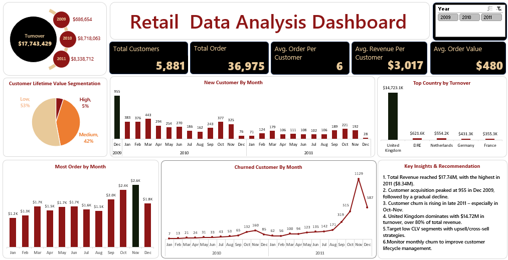

# 🛒 Retail Data Analysis Dashboard

An excel dashboard project analyzing customer behavior and sales performance using the [UCI Online Retail II dataset](https://archive.ics.uci.edu/ml/datasets/Online+Retail+II). This project uncovers key insights into customer segmentation, churn, order behavior, and regional sales distribution.

---

## 📊 Dashboard Overview



The dashboard covers:

- **Total Turnover:** $17.74M (2009–2011)
- **Customer Lifetime Value Segmentation**
- **New & Churned Customers by Month**
- **Monthly Orders and Seasonal Trends**
- **Top Countries by Revenue**
- **Key Performance Metrics**:
  - Total Customers: 5,881
  - Total Orders: 36,975
  - Avg. Order per Customer: 6
  - Avg. Order Value: $480
  - Avg. Revenue per Customer: $3,017

---

## 🔍 Key Insights

1. 📈 **Highest revenue** recorded in 2011 ($8.34M).
2. 👥 **Customer acquisition** peaked in Dec 2009 (955 new customers).
3. 🔁 **Customer churn** saw a major rise in late 2011.
4. 🌍 **United Kingdom** contributed over 80% of the revenue.
5. 🎯 **Low CLV segment** (53%) should be targeted with upselling/cross-selling strategies.
6. 📆 **Monthly monitoring** helps track customer lifecycle stages effectively.

---

## 💾 Dataset

- **Source:** [UCI Machine Learning Repository – Online Retail II](https://archive.ics.uci.edu/ml/datasets/Online+Retail+II)
- **File Used:** `online_retail_II_raw_data.xlsx`

---

## 🧰 Tools Used

- **Power Query**
- **Excel**
- **Excel Formulas (Count, CountA, If, Ifs, Sum, Xlookup, Unique)**

---

## 📁 Repository Structure

```bash
Retail-Data-Analysis-Dashboard/
│
├── Retail_Data_Analysis_Dashboard.png         # Final dashboard image
├── retail_data_analysis_dashboard.xlsx        # Processed dashboard file
├── online_retail_II_raw_data.xlsx             # Original dataset
└── README.md                                  # This file
